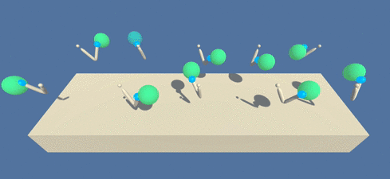

# DRL ContinuousActions ArmReacher
A DRL agent with continuous state and action space solved using deep deterministic policy gradients (DDPG) 

---

## Intorduction

In this Deep Reinforcement Learning project we train a single Unity ML-agent to move a double-jointed arm towards target locations in the [Reacher](https://github.com/Unity-Technologies/ml-agents/blob/master/docs/Learning-Environment-Examples.md#reacher) environment. 

  

Using continuous control the agent must move its hand to the goal location, and keep it there. A reward of +0.1 is provided if the hand is in the goal location and the environment is solved if the agent maintains an average score of 30 over 100 episodes.

## Getting Started

In order to run the environment you need to download it for your  operation system from one of the following links:
* Linux: [click here](https://s3-us-west-1.amazonaws.com/udacity-drlnd/P2/Reacher/one_agent/Reacher_Linux.zip)
* Mac OSX: [click here](https://s3-us-west-1.amazonaws.com/udacity-drlnd/P2/Reacher/one_agent/Reacher.app.zip)
* Windows (32-bit): [click here](https://s3-us-west-1.amazonaws.com/udacity-drlnd/P2/Reacher/one_agent/Reacher_Windows_x86.zip)
* Windows (64-bit): [click here](https://s3-us-west-1.amazonaws.com/udacity-drlnd/P2/Reacher/one_agent/Reacher_Windows_x86_64.zip)

Additionally you may need to install following packages: 
* **matplotlib**: used to visualise the training results 
* **numpy**: shouldn't really surprise you...
* **torch**: used for the deep neural networks
* **unityagents**: used to run the downloaded [Reacher](https://github.com/Unity-Technologies/ml-agents/blob/master/docs/Learning-Environment-Examples.md#reacher) environment. 

The packages can be directly installed while running the **Jupiter** notebook `ContinuousControl.ipynb`

## Instructions

You can run the project via the **Jupiter** notebook `ContinuousControl.ipynb`. The classes defining the agent and its "brain" are stored in `agent.py` and the depp neural networks for the actor and the critic are defined in `model.py`.
