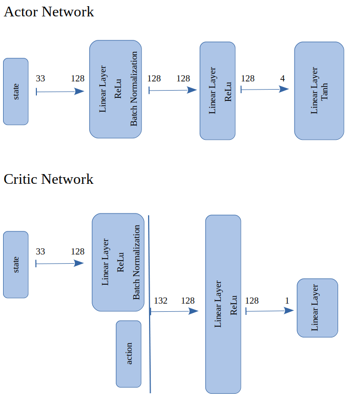
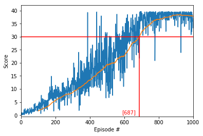

# Project report

## Learning algorithm

We implemented the deep deterministic policy gradient algorithm (DDPG), introduced to solve deep reinforcement learning problems with continuous actions. For more information, please see the following articles [Deterministic Policy Gradient Algorithms](http://proceedings.mlr.press/v32/silver14.pdf) and [Continuous control with deep reinforcement learning](https://arxiv.org/abs/1509.02971)

The algorithm uses two networks: an actor network which takes the current environment state as input and outputs an action and a critic network which takes the current state and action and returns the value of the state action function.

To solve the environment we used the following network architectures: 

  

 
The parameters used in the DDPG algorithm are as follows:

- **gamma**:
    RL [discount factor](https://en.wikipedia.org/wiki/Q-learning#Discount_factor) for future rewards  
- **learningRate (for actor and for critic)**:
    The learning rate for the gradient descent while training the (local) neural network; 
    This parameter corresponds more or less to the [learning rate](https://en.wikipedia.org/wiki/Q-learning#Learning_Rate) in RL controlling how much the most recent episodes contribute to the update of the Q-Table 
- **dqnUpdatePace**:
    Determines after how many state-action steps the local networks should be updated. 
- **dnnUpdatePace (for actor and for critic)**:
    * If targetDqnUpdatePace < 1: a soft update is performed at each local network update
    * If targetDqnUpdatePace >= 1: the target network is replaced by the local network
- **bufferSize**:
    Size of the memory buffer containing the experiences < s, a, r, s’ >
- **batchSize**:
    The batch size used in the gradient descent during learning
- **batchEpochs**:
    The number of epochs when training the network  

## Training and Results

To solve the environment we used following parameters:

|Parameter|Value|
|----------------------|-----|
|gamma|0.99|
|actorLearningRate|2e-4|
|criticLearningRate|2e-4|
|actorDnnUpdatePace|5e-3|
|criticDnnUpdatePace|5e-3|
|dnnUpdatePace|4|
|bufferSize|1e6|
|batchSize|128|
|batchEpochs|1|

With this parameters the environment was solved (i.e. the agent maintained an average score of 30 over 100 consecutive episodes) in 687 episodes. 

  

During parameter tuning we observed that the method is very sensitive to small changes of the hyper parameters and partially to the initial conditions (seed). 

## Possible Future Extensions of the Setting

1. It is clear that the parameters play a crucial role and one can always try to optimize these further.

The environment can be solved using a different algorithm: 

2. Truncated Natural Policy Gradient or Trust Region Policy Optimization: [link](https://arxiv.org/abs/1604.06778).

3. Proximal Policy Optimization Algorithms (PPO): [link](https://arxiv.org/pdf/1707.06347.pdf)

4. A3C: [link](https://arxiv.org/pdf/1602.01783.pdf)

5.  Distributed Distributional Deterministic Policy Gradients (D4PG): [link](https://openreview.net/pdf?id=SyZipzbCb)

6. Prioritized Experience Replay: [link](https://arxiv.org/abs/1511.05952)
